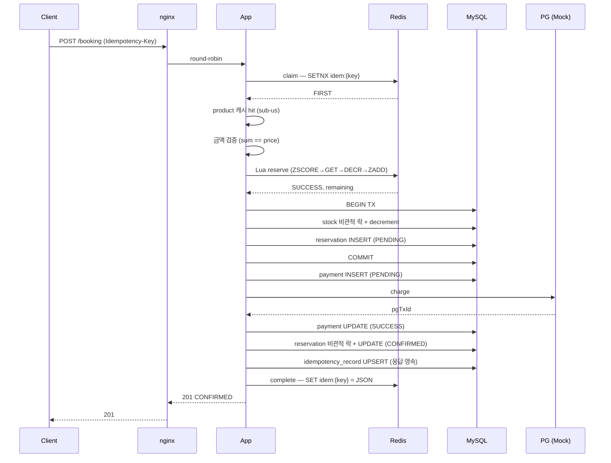
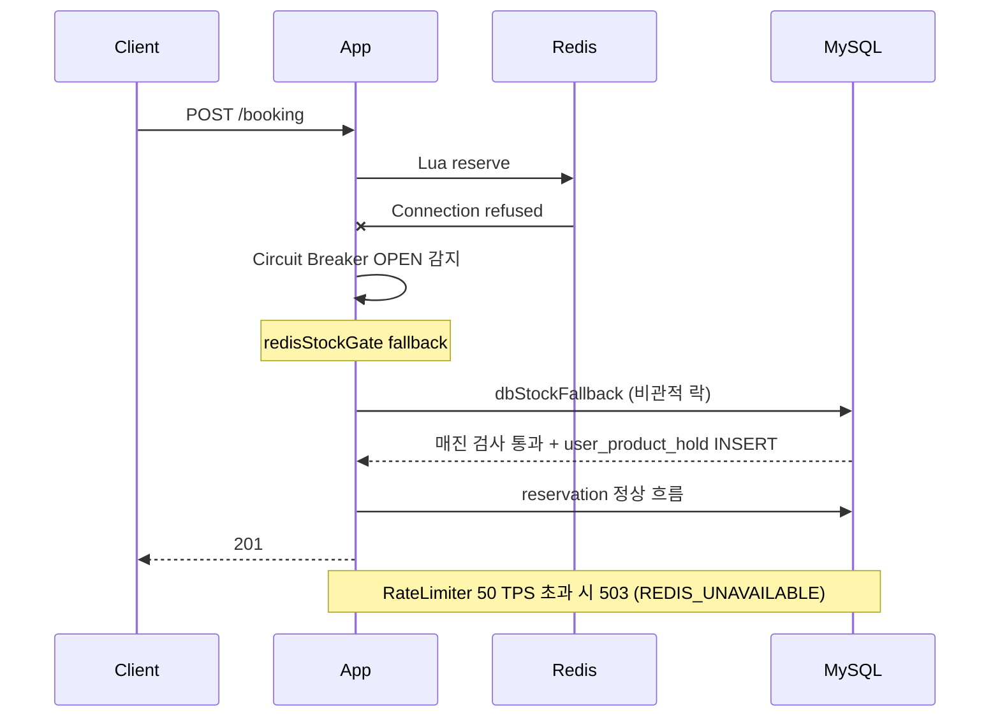
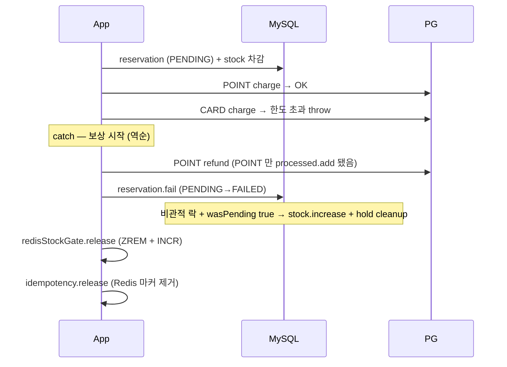
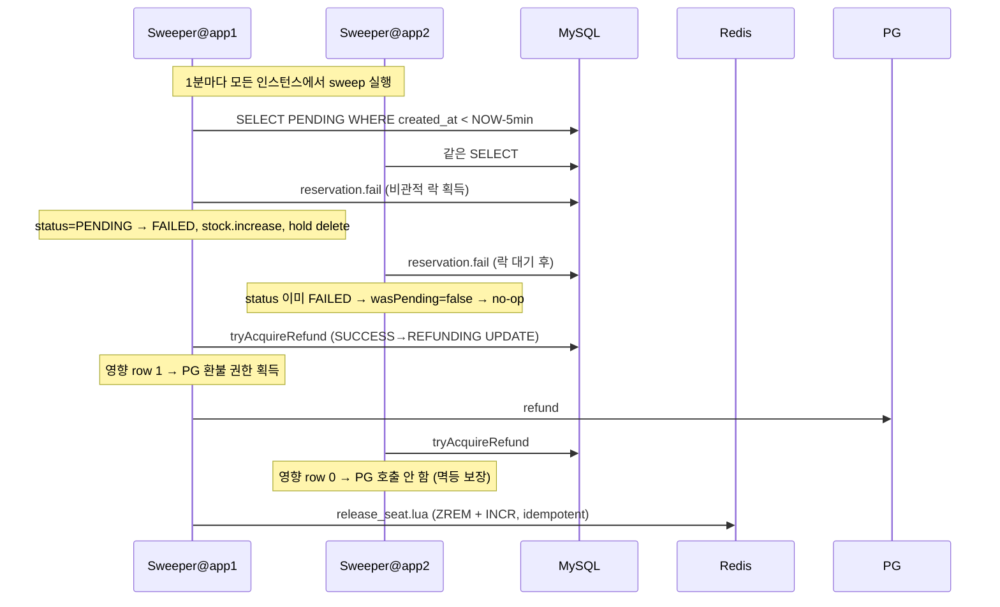

# 예약 시스템

분산 환경에서 한정 재고 상품을 처리하는 예약/결제 시스템.

설계 의사결정 상세는 [`DECISIONS.md`](DECISIONS.md) 참조.

---

## 1. 빠른 시작

### 사전 요구

- Docker Desktop (또는 Docker Engine + Docker Compose)
- Java 21 (테스트 실행 시)
- macOS 환경에선 `ulimit -n 4096` 권장 (부하 테스트 동시 connection)

### 컨테이너 일괄 기동

```bash
cd here/
docker compose -f infra/docker-compose.yml up -d --build
# 부팅 대기 (MySQL healthcheck + Spring Boot 부팅 완료)
sleep 30
```

### 동작 확인

```bash
# Checkout
curl 'http://localhost:8080/checkout?productId=1&userId=1'

# Booking — POINT 단독 결제
curl -X POST http://localhost:8080/booking \
  -H "Content-Type: application/json" \
  -H "Idempotency-Key: $(uuidgen)" \
  -d '{"userId":100,"productId":1,"paymentMethods":[{"method":"POINT","amount":50000}]}'

# 복합 결제 (CARD + POINT)
curl -X POST http://localhost:8080/booking \
  -H "Content-Type: application/json" \
  -H "Idempotency-Key: $(uuidgen)" \
  -d '{"userId":1,"productId":1,"paymentMethods":[{"method":"CARD","amount":20000},{"method":"POINT","amount":30000}]}'
```

### 정리

```bash
docker compose -f infra/docker-compose.yml down -v
```

### 컨테이너 구성

| 서비스 | 이미지 | 포트 | 역할 |
|---|---|---|---|
| `here-mysql` | mysql:8.4 | 3306 | 영속 진실 (DB) |
| `here-redis` | redis:7.4-alpine | 6379 | Phase A admission gate, 멱등 캐시 |
| `here-app1` | (빌드) | 8081 | Spring Boot 인스턴스 1 |
| `here-app2` | (빌드) | 8082 | Spring Boot 인스턴스 2 (분산 환경 검증) |
| `here-nginx` | nginx:alpine | **8080** | round-robin 로드 밸런서 |

---

## 2. API

### `GET /checkout` — 주문서 진입

**Query**
- `productId` (Long, required)
- `userId` (Long, required)

**Response 200**
```json
{
  "productId": 1,
  "name": "한정 특가 디럭스 트윈",
  "description": "도심 호텔 1박 한정 패키지 - 시즌 오프 특가",
  "price": 50000,
  "checkInAt": "2026-05-01T15:00:00",
  "checkOutAt": "2026-05-02T11:00:00",
  "openAt": "2026-04-29T00:00:00",
  "remainingStock": 10,
  "availablePoint": 30000
}
```

### `POST /booking` — 결제 및 예약 완료

**Header**
- `Idempotency-Key` (UUID, optional — 미전달 시 `auto:{userId}:{productId}` 자동 생성)

**Body**
```json
{
  "userId": 100,
  "productId": 1,
  "paymentMethods": [
    {"method": "CARD",  "amount": 20000},
    {"method": "POINT", "amount": 30000}
  ]
}
```

**Response 201**
```json
{
  "reservationId": 1,
  "status": "CONFIRMED",
  "productId": 1,
  "totalAmount": 50000,
  "createdAt": "2026-04-30T00:00:01"
}
```

### 응답 코드

| HTTP | code | 의미 |
|---|---|---|
| 201 | — | 예약 확정 |
| 400 | `PAY_001` | 결제 실패 (PG 한도 초과 등) |
| 400 | `PAY_002` | 유효하지 않은 결제 수단 조합 (예: CARD+YPAY) |
| 400 | `PAY_003` | 포인트 잔액 부족 |
| 400 | `PAY_004` | 결제 금액 합계 ≠ 상품 가격 |
| 400 | `PRODUCT_002` | 판매 오픈 시간 전 |
| 400 | `VALID_001` | 입력 검증 실패 (Bean Validation) |
| 404 | `PRODUCT_001` | 상품을 찾을 수 없음 |
| 409 | `STOCK_001` | 매진 |
| 409 | `STOCK_002` | 같은 사용자가 이미 동일 상품 예약 |
| 409 | `IDEM_001` | 중복 요청 (in-flight) |
| 500 | `SYS_999` | 처리되지 않은 서버 오류 |
| 503 | `SYS_001` | Redis 장애 + DB Fallback RateLimit 초과 |
| 503 | `SYS_002` | Bulkhead 포화 (시스템 과부하 보호 — `/checkout`) |

### 결제 수단 조합 정책

| 조합 | 허용 |
|---|---|
| `CARD` 단독 / `YPAY` 단독 / `POINT` 단독 | ✓ |
| `CARD + POINT` | ✓ |
| `YPAY + POINT` | ✓ |
| `CARD + YPAY` | ✗ (정책상 신용카드와 Y페이 혼용 불가) |

---

## 3. 시스템 아키텍처

```
                          ┌──────────────────┐
                          │     Client       │
                          └────────┬─────────┘
                                   │ HTTP
                          ┌────────▼─────────┐
                          │  nginx (LB)      │  port 8080, round-robin
                          └────┬─────────┬───┘
                  ┌────────────┘         └─────────────┐
                  │                                    │
            ┌─────▼──────┐                      ┌──────▼─────┐
            │  app1      │                      │  app2      │
            │  Spring 3  │  (Tomcat threads     │  Spring 3  │
            │  Boot      │   max 300)           │  Boot      │
            └──┬──┬──┬───┘                      └──┬──┬──┬───┘
               │  │  │                             │  │  │
               │  │  └──────┐ ┌────────────────────┘  │  │
               │  │         │ │                       │  │
               │  └─────────┼─┼───┐ ┌─────────────────┘  │
               │            │ │   │ │                    │
               ▼            ▼ ▼   ▼ ▼                    ▼
           ┌─────────────────────┐    ┌────────────────────────┐
           │   Redis             │    │   MySQL 8.4            │
           │   (admission gate,  │    │   (영속 진실)           │
           │    멱등 캐시)        │    │                        │
           │                     │    │  product               │
           │   stock:1   = 10    │    │  product_stock         │
           │   entered:1 ZSET    │    │  reservation           │
           │   idem:* INFLIGHT   │    │  payment               │
           │                     │    │  user_point            │
           │   Lua scripts:      │    │  idempotency_record    │
           │    reserve_seat     │    │  user_product_hold     │
           │    release_seat     │    └────────────────────────┘
           └─────────────────────┘
```

### Phase A / Phase B 분리

```
POST /booking
  │
  ├─ Phase A : 자리 확보       Redis Lua (sub-ms)        ← 30만 요청이 두드림
  │   ├ 멱등 claim (Redis)
  │   ├ product 검증 (in-memory cache)
  │   └ Redis admission gate (atomic Lua)
  │
  └─ Phase B : 결제 + 영속화    DB + 외부 PG (1~2초)     ← 통과한 ~10건만 도달
      ├ reservation INSERT (PENDING) + stock decrement (단일 TX)
      ├ paymentOrchestrator.process — Saga (POINT → CARD/YPAY)
      └ reservation.confirm (CONFIRMED)
```

핵심: 거절 경로(Phase A) 와 통과 경로(Phase B) 의 SLA·자원·실패 정책을 *완전히 별개로* 설계.

---

## 4. 시퀀스 다이어그램

### 정상 booking 흐름



### Redis 장애 시 fallback



### 결제 실패 보상



### Sweeper (멀티 인스턴스 안전)



---

## 5. ERD

```
┌────────────────────────────┐         ┌──────────────────────┐
│ product                    │   1:1   │ product_stock        │
│  id PK                     ├─────────┤  product_id PK       │
│  name, description, price  │         │  remaining           │
│  check_in_at, check_out_at │         │ (핫 row 격리)         │
│  total_stock, open_at      │         └──────────────────────┘
└────┬───────────────────────┘
     │ 1:N
     │
     ▼
┌────────────────────────────────────┐         ┌──────────────────────┐
│ reservation                        │   1:N   │ payment              │
│  id PK                             ├─────────┤  id PK               │
│  user_id, product_id               │         │  reservation_id FK   │
│  total_amount                      │         │  method (enum)       │
│  status (PENDING/CONFIRMED/        │         │  amount              │
│   FAILED/CANCELLED)                │         │  status (PENDING/    │
│  idempotency_key UNIQUE            │         │   SUCCESS/FAILED/    │
│  created_at, updated_at            │         │   REFUNDING/         │
│  INDEX (status, created_at)        │         │   REFUNDED)          │
└────────────────────────────────────┘         │  pg_transaction_id   │
                                               └──────────────────────┘

┌────────────────────────────┐
│ user_point                 │
│  user_id PK                │
│  balance                   │
│  version (낙관적 락)        │
└────────────────────────────┘

┌────────────────────────────┐         ┌──────────────────────────┐
│ idempotency_record         │         │ user_product_hold        │
│  idempotency_key PK        │         │  id PK                   │
│  response_json (TEXT)      │         │  (user_id, product_id)   │
│  status (INFLIGHT/         │         │   UNIQUE                 │
│   COMPLETED)               │         │  held_at                 │
│  created_at, completed_at  │         │ (DB Fallback 1u1p 안전망) │
└────────────────────────────┘         └──────────────────────────┘
```

### DDL 명시 스크립트

전체 DDL 은 [`db/schema.sql`](db/schema.sql) 참조. 운영 환경에선 별도 마이그레이션 도구(Flyway 등) + `ddl-auto: validate` 로 전환 권장. 본 환경은 멀티 인스턴스 안전을 위해 `ddl-auto: update` 사용.

---

## 6. 디렉토리 구조

```
here/
├── src/main/java/com/hah/here/
│   ├── booking/         BookingController/Service — Phase A/B 오케스트레이션
│   ├── checkout/        CheckoutController/Service — 주문서 조회
│   ├── payment/         결제 (Strategy + Composition + Saga + Mock PG)
│   ├── reservation/     Reservation 영속화 + ReservationSweeper
│   ├── stock/           Phase A admission gate (Redis Lua + DB Fallback) + StockSweeper
│   ├── idempotency/     멱등 처리 (Redis 우선 + DB 영속)
│   ├── point/           사용자 포인트
│   ├── product/         상품 (read-through 캐시)
│   └── common/          ErrorCode, GlobalExceptionHandler, RedisConfig
├── src/main/resources/
│   ├── application.yaml
│   ├── data.sql         초기 시드 (INSERT IGNORE)
│   └── lua/
│       ├── reserve_seat.lua    Phase A atomic
│       └── release_seat.lua    보상 atomic
├── src/test/java/       41개 테스트
├── db/schema.sql        명시적 DDL
├── DECISIONS.md         설계 의사결정 기록
├── AI_USAGE.md          AI 도구 활용 범위와 본인 기여 분리
└── infra/
    ├── Dockerfile       multi-stage (JDK 21 빌드 → JRE 21 실행)
    ├── docker-compose.yml
    └── nginx.conf       round-robin upstream
```

---

## 7. 테스트

```bash
./gradlew test
```

전체 41개 통과 (약 18초):

| 테스트 | 종류 | 검증 |
|---|---|---|
| `PaymentCompositionTest` | 단위 | 결제 조합 정책 (허용/금지/edge) |
| `PaymentOrchestratorTest` | 단위 (Mock) | Saga 흐름, POINT 우선, 역순 환불, refundAll 멱등, markSuccess 실패 시 환불 누락 차단 |
| `RedisLuaCallerIntegrationTest` | 통합 (Testcontainers) | Lua atomic 분기 (SUCCESS/SOLD_OUT/KEY_MISSING/ALREADY_RESERVED), ZSET timestamp, release 멱등 |
| `IdempotencyServiceIntegrationTest` | 통합 | claim/complete/release Redis + DbStore fallback + 응답 재현 |
| `BookingConcurrencyIntegrationTest` | 통합 | **1000 동시 booking → 정확히 10건 CONFIRMED, 오버셀 0** (재고 정합성 검증) |
| `HereApplicationTests` | smoke | 컨텍스트 부팅 검증 |

테스트는 모두 Testcontainers(MySQL + Redis) 위에서 실행 — 실 컨테이너로 *진짜 동시성 / 진짜 Lua 동작* 검증.

---

## 8. 부하 테스트 (k6)

`k6_test.js` (단순 burst), `k6_realistic.js` (조회+결제 혼합).

```bash
brew install k6
ulimit -n 4096

# 단순 burst (1000 동시 booking)
k6 run k6_test.js

# 조회 + 결제 혼합 시나리오
k6 run k6_realistic.js
```

### 실측 결과 (macOS Docker Desktop, app 2 instances)

**단순 burst (`k6_test.js`)** — 1000 vus → 1000 booking
| 지표 | 결과 |
|---|---|
| 정합성 | 정확히 10건 CONFIRMED, 990건 거절 (오버셀 0) |
| checks pass | 100% |
| 처리량 | 약 500 req/s |
| 통과 p99 | 1.69s |
| 거절 p99 | 1.89s |

**혼합 시나리오 (`k6_realistic.js`)** — checkout 50 TPS 지속 + booking 1000 burst
| 지표 | 결과 |
|---|---|
| Booking 정합성 | 정확히 10건 CONFIRMED |
| Checkout p50 | 4.76ms (Product 캐시 hit) |
| Checkout p95 | 138ms |
| Checkout p99 | 730ms (booking burst overlap window) |
| 부하 격리 | Bulkhead("checkout") 효과 확인 |

### 환경 한계 명시

서버 측 처리는 **약 150ms 안에 완료** (서버 로그 시각 기준). 클라이언트 측정 latency 가 더 큰 것은 macOS Docker Desktop VM 의 NW 오버헤드 + Tomcat queue + connection establishment 합산. Linux native + production NW 환경에선 sub-200ms 거절 달성 기대.

---

## 9. 운영 메모

### 환경변수

| 변수 | 기본값 | 설명 |
|---|---|---|
| `DB_HOST` | localhost | MySQL host |
| `DB_PORT` | 3306 | |
| `DB_NAME` | here_db | |
| `DB_USERNAME` | root | |
| `DB_PASSWORD` | root | |
| `REDIS_HOST` | localhost | |
| `REDIS_PORT` | 6379 | |
| `SERVER_PORT` | 8080 | |

### 시드 데이터 (data.sql)

- `product` id=1: 한정 특가 디럭스 트윈, 가격 50000, 재고 10, open_at 2026-04-29
- `user_point`: user 1=30000, 2=10000, 3=0, 100=100000, 200=50000

### 헬스체크

```bash
docker exec here-mysql mysqladmin ping -h localhost -uroot -proot
docker exec here-redis redis-cli ping

# DB 정합성 검증
docker exec here-mysql mysql -uroot -proot here_db -e \
  "SELECT status, COUNT(*) FROM reservation GROUP BY status;"

# Redis stock 확인
docker exec here-redis redis-cli GET stock:1
docker exec here-redis redis-cli ZCARD entered:1
```

### Redis 장애 시뮬

```bash
docker stop here-redis
# 부하 발생 시 Circuit Breaker OPEN → DbStockFallback 우회 (RateLimit 50 TPS) 확인
docker logs here-app1 | grep "Redis admission 비정상\|Circuit"
docker start here-redis
```
# reservation-hw
